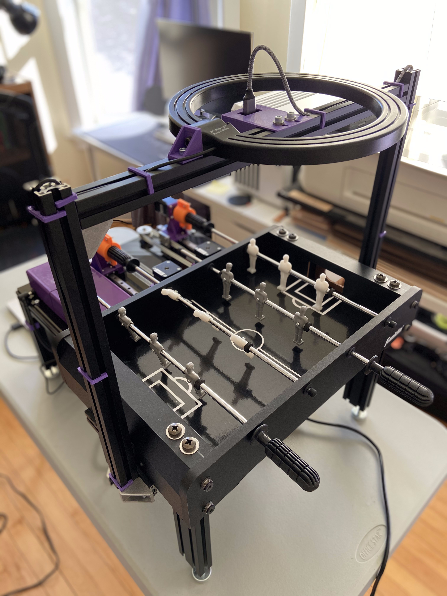
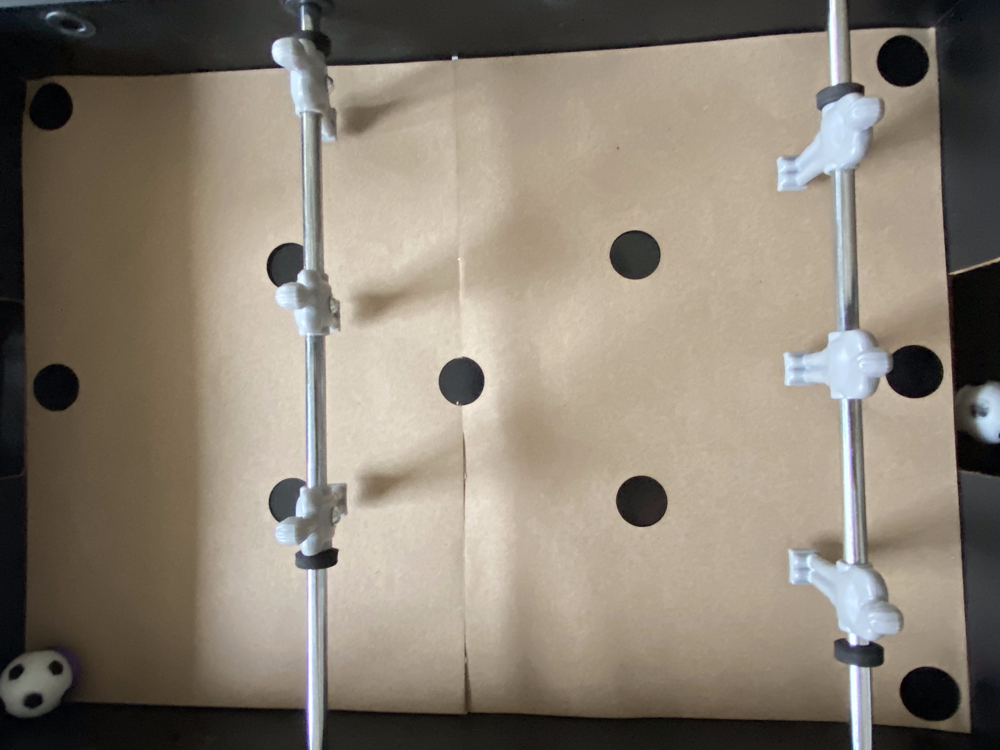
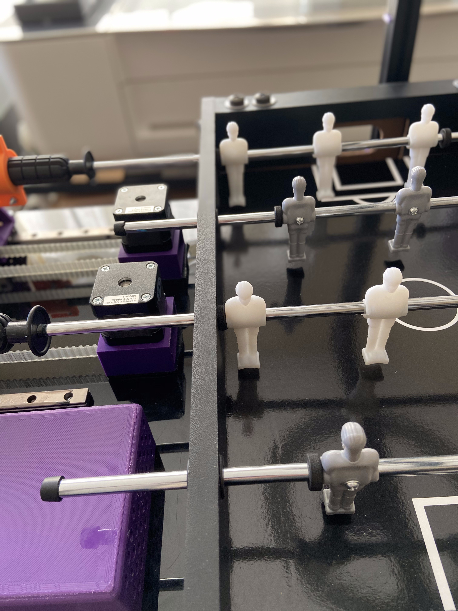

# Single Player Foosball Table



## Dependencies
The following are other software packages required to run the software for the table:
  - ROS Melodic
  - Pololu tic Software
  - OpenCV

## Installation

Begin by installing some of the external software dependancies:
  - The instructions for installing ROS Melodic are found [here](http://wiki.ros.org/melodic/Installation/Ubuntu).

  - The instructions to install the Pololu tic Software are found [here](https://github.com/pololu/pololu-tic-software). See relevant section in the BUILDING.md file to build the library from source, these were the [directions](https://github.com/pololu/pololu-tic-software/blob/master/BUILDING.md#building-from-source-on-linux-for-linux) I used.

After installing these create a new catkin workspace and clone this repository:

```
mkdir SinglePlayerFoosball
cd SinglePlayerFoosball
git clone https://github.com/rencheckyoself/single_player_foosball.git src
```

Then go into the repository and use wstool. This will download my forked version of the oCam package. It has been updated to function properly with ROS Melodic and adds some extra configuration for including the main launch file.
```
cd src
wstool update
```

Finally, go back to the top level of the directory and build the workspace:
```
cd ..
catkin_make
```

## Table Assembly

The CAD and Bill of Materials are located at this google drive [link](https://drive.google.com/drive/folders/1ccFXVZE29upyrK4uFZC98GBmM7wjYVV8?usp=sharing). You will an assembly procedure along with pictures depicting some of my build process and final assembly.

## Visualizations

This workspace includes two methods of visualizations, a urdf model displayed in rviz and an OpenCV window of the camera feed with added data.

#### rviz
 The urdf model will responds to all of the joint state messages displaying the positions that the gameplay node has decided to move to. It will also show a marker for most recent location of the ball.

#### OpenCV window
This window is generated by the `opencv_viewer` node. This will update everytime the camera sends a new image. The top corner shows the approximate frame rate of the images coming in. A red dot at the location of the most current ball position at the time an image is received. If the `ball_tracking` node does not detect a ball, the dot will appear in the upper left hand corner of the image. Also displayed is the player angle detection results. A white rectangle will show the ROI the `player_tracking` node is using and when the rods move, another rectangle will bound the detected player. A blue rectangle means the player is detected as down and the ball cannot pass underneath, green means the players are raised and at the end of a kick, red means the players are raises with their feet closest to the goal.

## Required Configuration

1. Update `table_motor_control/config/motor_ids.yaml` with the serial numbers for your specific TIC boards. These can be obtained by using the ticgui or ticcli.
2. Calibrate your camera. I have included the calibration file for my camera in the ocam package files, but it may not be suitable for yours.
3. If you are using a different ball and/or table you may need to retrain the cascade classifier.
4. Update the pixel locations for the known pairs of world locations to pixel locations in order to calculate the homography.
5. Update the parameters to generate the joint_states/stepper commands to account for the differences in the camera position and calibration.
6. Update the parameters for the player angle detection.

### Tic Serial Numbers:
Once everything is wired and after installing the tic software, open a terminal and use the command `ticgui`. Plug in boards one at a time and copy over the serial number to the `motor_ids.yaml` file. Be sure that the serial numbers are copied over to the correct parameter in the yaml file.

### Camera Calibration:
There is a calibration file included in the ocam package from the .rosinstall file. This may or may not work for your ocam camera, so in order to generate your own calibration file, use the [`camera_calibration`](http://wiki.ros.org/camera_calibration) package in the ROS Image Pipeline. There is an included checkerboard in the `table_vision_sensing/calibration` directory to print out and use for the calibration.
Use the commands below to start the calibration using the included checkerboard:
```
roslaunch ocam ocam_ros.launch show_image:=false

rosrun camera_calibration cameracalibrator.py --size 7x5 --square 0.033 image:=/camera/image camera:=/camera
```
Once everything launches, move the checkerboard around in the image until the calibration button becomes available. Click calibrate and wait for the process to finish. The location of the output with be show in the terminal. Copy the `camera.yaml` generated by the calibration into `ocam/config`.

### Training the cascade classifier:
I have included the model I trained in the `cascade_data` folder, but if you don't have the same table/ball as my set up or want to experiment you can train your own cascade model.

OpenCV provides a great [walk-through](https://docs.opencv.org/3.4/dc/d88/tutorial_traincascade.html) for how to use their provided tools to generate the final output. Read through this first, then use the following to help with collecting your image dataset and generating the trained model.

To collect your own image set using the camera mounted over the table use the `capture_training_image.launch` file. This file will start nodes that create a new directory inside the `table_vision_sensing` package called `training_data`. Inside will be the `.dat` files required for the OpenCV training pipeline and two directories corresponding to the saved images. After launching, two windows will be displayed one called "Capture for background" and "Capture for ball".
 - To save an image for the background/negative set, click on the "Capture for background" window and click the "s" key. The picture will be saved in `training_data/background` directory and the proper annotation recorded in the `background.dat` file. All of the images in the background set should not contain the ball.
 - To save an image for the ball/positive set, click on the "Capture for ball" window and click the "s" key. The picture will be saved in the `training_data/ball` directory. Use the opencv tool for annotating positive images after all have been collected.

If you want to add you your collected set later, just relaunch the file and the numbering for the ball and background images will pick up where each set left off. Modify the `image_group` launch file argument to save positive images to a new directory.

```
roslaunch table_vision_sensing capture_training_data.launch image_group:=ball
```

You can also use the camera to capture gameplay footage and then use vlc to extract frames from the video and save them as images. I used the camera launch file then used a screen recorder to capture the OpenCV window.

```
roslaunch table_vision_sensing start_ocam.launch view_image:=true show_ball_pos:=false show_player_angle:=false
```

Once the video is captured, either follow [this](https://www.raymond.cc/blog/extract-video-frames-to-images-using-vlc-media-player/) to use the vlc gui to save out frames as images or use the following command:
```
cd [path_to_workspace]/src/table_vision_sensing
mkdir training_data/gameplay_frames
cvlc [video_name] --video-filter=scene --vout dummy --scene-ratio 60 --scene-path src/table_vision_sensing/training_data/ball/ --scene-prefix gameplay --start-time 0 --stop-time 120 vlc://quit
```
- --scene-prefix: a unique name to append to the beginning of each saved frame. (optional)
- --start-time: time to start at in seconds (optional)
- --stop-time: time to stop at in seconds (optional)
- --scene-ratio: how often to save frames. i.e. a scene-ratio of 60 for a video recorded at 60 fps will save 1 image every second.

Each time you run the command the number will always start at 1 regardless of the time span used so if your want to use a bunch of small pieces of the video, modify the --scene-prefix to avoid overwriting previously generated images. Also if you use the command line, I got a lot of error messages that popped up, but it didn't effect the functionality. The command will terminate once all of the frames have been saved. See the [VLC Documentation](https://wiki.videolan.org/VLC_command-line_help) for more information or use `vlc --full-help`.

Data collection tips:
- Collect all of the pictures with the overhead light on.
- If your ball has a pattern, be sure to rotate the ball between still image shots.
- Take picture of the ball partially occluded by the players and rods.
- Take background pictures with the players in various orientations.
- Take pictures of the ball when it is moving fast as well as slow.

You will want to collect 2:1 positive to background images. I used roughly 1000 positive images and 500 background images. After all of your images are collected, use the integrated annotation tool provided by OpenCV to properly annotate the ball/positive image set. It should take about 45min to annotate 1000 positive images. Using the following:
```
cd [path_to_workspace]/src/table_vision_sensing/training_data
opencv_annotation --annotations  -ball.dat --images ball/
```

After the annotations have been completed, use the provided OpenCV tool to create the positive image set .vec file. Use the following command:
```
cd [path_to_workspace]/src/table_vision_sensing/training_data
opencv_createsamples -vec ball.vec -info ball.dat -w 24 -h 24 -num [number of images]
```

After the .vec file has been generated, use the cascade trainer to get the trained cascade model for ball detection. The following was my configuration but your mileage may vary. I also tweaked the minHitRate to 0.999 and maxFalseAlarmRate to 0.1 as well. See the OpenCV documentation for all of the possible training parameters to play with.
```
cd [path_to_workspace]/src/table_vision_sensing/training_data
mkdir ../cascade_data
opencv_traincascade -data ../cascade_data/ -vec ball.vec -bg background.dat -w 24 -h 24 -numPos 700 -numNeg 500 -numStages 25
```

### Homography Calculation
In order to transform the ball's image coordinates to world coordinates, the system needs to know some known pairs. So you will need to update the `homography_config.yaml` file in the `table_gameplay_ai/config` directory to adjust for the slight differences in the camera location. Included in that directory is a template corresponding to the world positions already listed in the `homography_config.yaml` file and an .stl for a stand that neatly fits into the circles on the template. Print out two copies of the template, attach them along the middle and and place it on the field.

Then start up the ball tracking node, echo the `/BallPosition` topic in a separate terminal and record the average `(x,y)` pixel values in the `.yaml` file. Be sure that as the image coordinates are entered in to the .yaml file, they are entered on the correct line.

```
roslaunch table_vision_sensing start_tracking.launch view_image:=true
rostopic echo /BallPosition
```



### Command Generation Configuration

The two parameters that will most likely need adjusted are the `def_rod_xpos` and the `fwd_rod_xpos` in the `command_generation_config.yaml`. These parameters define the x position of the ideal location to strike the ball for each rod. In order to update these, use `start_game.launch` but leave the motors unpowered so the rods stay stationary. Position the players vertically and place the ball directly in front of a player. Either use rviz or echo the `visualization_marker` topic to see the x position of the ball in the world coordinates. Record this value in the `command_generation_config.yaml` file for the automated defensive rod and the automated offensive rod.

If you are using a different sized table, you will need to update the joint limits as well to account for linear travel of the rod. You may also want to update `table_params.yaml` in the `table_description` package in order to correct the visualization. For example, the rods on my table can travel 0.09m linearly. The urdf assumes the 0 position is in the middle so the joint limits will be at -0.45 and 0.45. For my table, 0.09m corresponds to roughly 240 steps to make the rod travel the full distance. When the game starts up, the gameplay node assumes the rod is already in 0 position. I chose to have the lower stepper position limit be the 0 position which makes the upper stepper position limit 240.

You can also modify the `linear_hysteresis` parameter to make the linear motion more or less sensitive to changes in the ball position.

### Player Angle Detection Configuration

You may need to adjust the player angle detection parameters in `player_angle_detection.yaml` to account for your camera's position and calibration. Use the `start_tracking.launch` file with `view_image:=true` to display results of the player angle detection. First modify the roi_x and roi_y, roi_width, and roi_height so that the large white rectangles capture one of the players on the two automated rods.

After the windows are properly aligned use rostopic echo to listen to the `\Def_RodState` and `\Fwd_RodState`. The player detection works using background subtraction, so in order use the detection the rod needs to move. Rotate the rod parallel to the table (like it just finished a kick) and slowly move it back and forth. Update `end_kick_x` value to a something a few less than the `min_x_value` shown on the topic and update `end_kick_width` to something a few less than the maximum `bounding_rect_img.width` value shown on the   topic.

If the bounding rectangle is not showing up when the player is moving, decrease `area_limit`. If small contours that are not part of the player are being detected, increase `area_limit`.

## How to Run:

Position players in the assumed starting position: the players feet down, perpendicular to the table with the rod against the wall closest to the motors, like so:




Plug in power supply to the barrel jack connector, then plug it into the wall and flip the switch to turn on the table.

Launch main launch file:
```
roslaunch table_gameplay_ai start_game.launch with_rviz:=false view_image:=false
```

Throw ball onto table and play!

## Packages

### Description
This package provides a urdf model of the foosball table that can be displayed in rviz.

Launch Files:
- `view_table.launch`: Launch rviz and display the urdf along with the joint state publisher gui.
  - use_gui, default: true. Set this to false to turn off the joint state publisher
  - rviz_config, the location of the rviz configuration file
  - with_rviz, default: true. Set to false to not launch rviz.

Configuration:
- `table_params.yaml`: measurements of the physical table. Changing these will update the urdf.

### Control
This package provides an interface to work with the TIC Stepper Controller API through ROS by offering services.

Launch Files:
- `tic_controllers.launch`: launch all of the nodes to interact with the motors

Nodes:
- `tic_cmd`: node that starts up services to manually interact with each controller. If a controller is not connected, this will not launch properly.

Configuration:
- `motor_ids.yaml`: contains all of the identifying information for each controller. This file must be updated with the serial numbers for your purchased boards.
- `*_settings.txt`: these files contain the detailed settings for each of the motors. They were initially generated by exporting the settings using the ticgui. These files can be used to update the settings of a given tic while everything is running using the `*_update_settings` service. The can also be uploaded using the ticgui tool.

### Vision
This package is currently set up to follow the [ROS image_pipeline](http://wiki.ros.org/image_pipeline) structure. The `table_vision_sensing` package is set up to be camera agnostic, so feel free to use your own camera in place of the one linked in the parts list. You will need to modify the launch files to use your own camera.

Launch Files:
- `start_ocam.launch`: Launch the camera and view the rectified image
  - view_image, default: false. Set this to false to the rectified image.
  - show_ball_pos, default: true. Set this to false to not display a red dot for the ball position on the image feed.
  - show_player_angle, default: true. Set to false to not display bounding rectangles for the player angle.
- `start_tracking.launch`: Launch the ball and player tracking nodes. set view_image to true to view the output.
  - view_image, default: false. Set this to false to the rectified image.
- `capture_training_data.launch`: Launch everything to collect images to train the cascade classifier
  - image_group, default: "ball". A string to use as the name for a directory of positive images.

Nodes:
 - `ball_tracking`: Use the trained cascade model to find and publish the ball's pixel location
 - `opencv_viewer`: Listen to an image topic and display the image along with the ball position and player angle info
 - `player_tracking`: Use background subtraction and contour fitting to determine the approximate angle of the player
 - `training_image_capture`: Listen to an image topic to collect data to train a cascade classifier

Configuration:
 - `player_angle_detection.yaml`: contains all of parameters to define the window to analyze and the parameters to detect if the players are raised and which side the feet are closest to.

### Gamplay
This package is used as the main decision making pipeline based on the detected ball position and creates a joint state message that can be used by the urdf model for testing or converted to stepper commands using the `table_motor_control` package.

Launch Files:
- `start_game.launch`: Launches everything to play a game of foosball against the table
  - with_rviz, default: true. Set to false to not launch rviz.
  - view_image, default: false. Set this to false to the rectified image.
- `start_simulation.launch`: Uses the real ball position on the table, but does not actuate the real motors only the urdf model in rviz.

Nodes:
- `follow_ball`: The main node to decide the action and publish the joint state message.

Config:
- `homography_config.yaml`: contains know pairs of world location to pixel location in order to calculate the homography.
